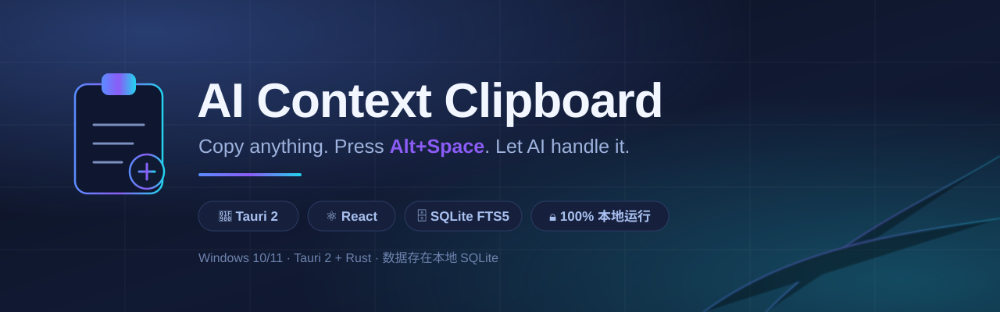
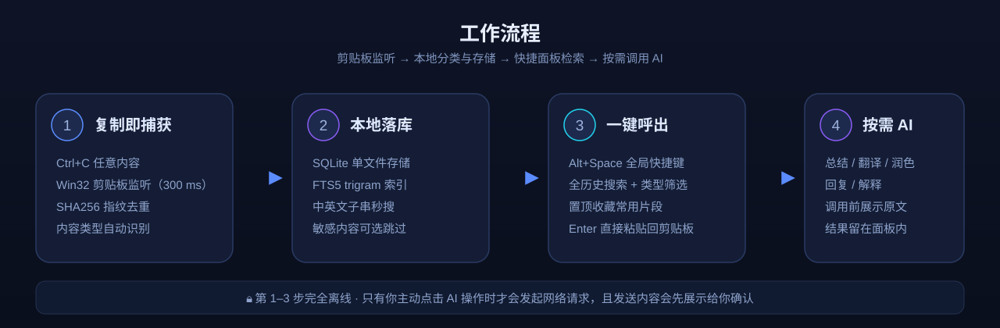

<div align="center">



[](https://github.com/Ahao665/ai-context-clipboard/actions/workflows/ci.yml)
[](https://github.com/Ahao665/ai-context-clipboard/releases)
[](LICENSE)
[](#-系统要求)
[](https://tauri.app)
[](https://www.rust-lang.org)

**不是又一个剪贴板管理器，而是你的本地 AI 助手入口。**

复制任意内容 → `Alt+Space` 呼出 → 一键总结 / 翻译 / 润色 / 回复 / 解释。
Rust + Tauri 构建，安装包约 3 MB，数据全程留在本机。

[功能特性](#-功能特性) · [安装](#-安装) · [快速开始](#-快速开始) · [快捷键](#️-快捷键) · [隐私](#-隐私与安全) · [架构](#️-项目架构) · [开发](#-开发)

</div>

---

## 为什么做这个

Windows 自带剪贴板只能存 25 条、搜不了中文、更没有 AI。市面上的剪贴板管理器（Ditto、CopyQ）检索能力很强，但都把"复制之后要干什么"留给你自己。

而日常最真实的场景是：**你刚复制了一段报错日志 / 一段英文文档 / 一封要回复的邮件，然后要切到浏览器、打开某个 AI 网站、粘贴、敲提示词、等待、再复制回来。**

这个项目把这条链路压成两步：`Alt+Space` → 点一下。

同时它坚持三条底线：**数据不出本机**、**AI 调用前必须让你看到发送内容**、**不配 API Key 也能当纯本地剪贴板历史用**。

## ✨ 功能特性

| 能力 | 说明 |
|------|------|
| 🎯 **智能剪贴板监听** | 300 ms 轮询 Win32 剪贴板，SHA256 指纹去重，重复内容自动合并 |
| 🔍 **全历史全文搜索** | SQLite **FTS5 trigram** 索引，覆盖**整库**而非当前窗口；中英文子串均毫秒级命中 |
| 🏷️ **内容类型自动识别** | 复制即分类为 链接 / 代码 / JSON / 邮箱 / 文本，并细分语言、路径、颜色等子类型 —— 纯本地启发式，零网络调用 |
| 🔒 **敏感内容保护** | 识别私钥、`password=` / `token=` / `api_key=` 赋值、`sk-` / `ghp_` / `AKIA` 前缀、JWT、数据库连接串等；可开启「跳过敏感内容」使其根本不落库 |
| 📌 **置顶收藏** | 常用片段置顶后永远排最前，列表与搜索排序一致，乐观更新失败自动回滚 |
| 🧩 **类型筛选** | 链接 / 代码 / JSON / 邮箱 / 文本 一键筛选；筛选在**后端执行**，因此同样作用于全量历史 |
| 🤖 **5 种 AI 操作** | 总结、翻译、润色、回复、解释 —— 开箱即用的提示词工程，无需自己写 prompt |
| 🔌 **任意 OpenAI 兼容 API** | DeepSeek / OpenAI / 通义千问 / Kimi 一键预设，也可填自定义 Base URL |
| ⚡ **全局快捷键** | `Alt+Space` 在任意应用上层呼出面板，置顶浮窗不抢焦点 |
| 🛡️ **隐私确认** | 首次调用 AI 前弹窗展示**即将发送的完整内容**，可「不再提示」，也可随时在设置里恢复 |
| 🪶 **轻量** | Tauri 2 后端，安装包约 3 MB，常驻内存远低于 Electron 方案 |
| 🗃️ **可维护的历史** | 历史条数上限真实生效、软删除 + 物理清理（`VACUUM`）、一键清空 |

### 它和其他剪贴板工具的区别

| | Windows 剪贴板 | Ditto / CopyQ | **AI Context Clipboard** |
|---|---|---|---|
| 历史条数 | 25 | 无上限 | 无上限（可配置） |
| 中文搜索 | ❌ | 一般 | ✅ FTS5 trigram 子串匹配 |
| 内容类型识别 | ❌ | ❌ | ✅ 链接 / 代码 / JSON / 邮箱 / 文本 |
| 敏感信息保护 | ❌ | ❌ | ✅ 识别并可跳过落库 |
| 内置 AI 处理 | ❌ | ❌ | ✅ 5 种操作 + 任意兼容 API |
| 数据本地 | ✅ | ✅ | ✅ |

## 🖥️ 系统要求

- **Windows 10 / 11 (x64)**
- [WebView2](https://developer.microsoft.com/en-us/microsoft-edge/webview2/)（Windows 10 1803+ 已内置，无需单独安装）

> 目前仅支持 Windows。剪贴板读写直接调用 Win32 API（`CF_UNICODETEXT`），这也是它足够轻的原因。

## 📥 安装

### 方式一：下载安装包（推荐）

前往 [**Releases**](../../releases/latest) 下载最新安装包：

| 格式 | 文件 | 体积 | 说明 |
|------|------|------|------|
| NSIS | `AI Context Clipboard_0.3.0_x64-setup.exe` | 约 3.2 MB | 体积最小，安装向导友好（推荐） |
| MSI | `AI Context Clipboard_0.3.0_x64_en-US.msi` | 约 5.4 MB | 适合企业分发 / 组策略部署 |

```bash
# 或命令行安装
msiexec /i "AI.Context.Clipboard_0.3.0_x64_en-US.msi"
```

### 方式二：从源码构建

```bash
git clone https://github.com/Ahao665/ai-context-clipboard.git
cd ai-context-clipboard
pnpm install
pnpm exec tauri build --bundles "msi,nsis"
```

产物位于 `src-tauri/target/release/bundle/`。

> 构建需要 Rust（MSVC 工具链）+ Node.js 20+ + pnpm + VS 2022 Build Tools。
> 如果你在 **Git Bash** 里构建遇到 `link: missing operand` 或 `LNK1181`，请先看 [docs/BUILD-WINDOWS.md](docs/BUILD-WINDOWS.md) —— 那是 Git Bash 自带的 `link.exe` 遮蔽了 MSVC 链接器导致的，文档里有完整修复步骤。

## 🚀 快速开始

### 1. 让应用跑起来

安装后启动，应用常驻后台并开始监听剪贴板。**这一步不需要任何配置，也不需要 API Key** —— 它已经可以当纯本地剪贴板历史用了。

### 2. 配置 AI（可选）

1. `Alt+Space` 打开面板
2. 点右上角 **⚙️**
3. 选择服务商预设，填入 API Key，保存

设置面板里还能：

- 开关「每次调用前询问」隐私确认
- 开启「跳过敏感内容」（含密钥的复制内容不写入历史）
- 查看当前历史条数、一键清空历史
- 查看全局快捷键

### 3. 使用

1. `Ctrl+C` 复制任意内容
2. `Alt+Space` 呼出面板
3. 输入关键词搜索，或用类型筛选缩小范围
4. `Enter` 把选中项复制回剪贴板；`Shift+Enter` 查看详情
5. 在详情页点 AI 操作；或在面板里直接输入 `总结` / `翻译` 等命令并回车

| AI 操作 | 说明 |
|---------|------|
| 📝 **总结** | 提取内容要点，分点列出 |
| 🌐 **翻译** | 翻译为中文，保留原有格式 |
| ✨ **润色** | 改进表达，更清晰专业 |
| 💬 **回复** | 根据内容生成自然回复 |
| 🔍 **解释** | 用简单语言解释复杂内容 |

## ⌨️ 快捷键

| 按键 | 行为 |
|------|------|
| `Alt+Space` | 全局呼出 / 收起面板 |
| `↑` `↓` | 上下移动选择 |
| `Enter` | 复制选中项并关闭面板；若选中命令则执行该 AI 操作 |
| `Shift+Enter` | 打开选中项详情 |
| `Esc` | 有输入时清空输入；输入为空时关闭面板 |

> 面板做了 **IME 保护**：中文输入法组词期间（`isComposing`）所有按键都会被抑制，不会出现"打字打到一半把面板关了"的情况。

## 🔌 支持的 AI 服务

兼容 OpenAI Chat Completions 协议：

| 服务 | Base URL | 推荐模型 |
|------|----------|----------|
| [DeepSeek](https://platform.deepseek.com) | `https://api.deepseek.com/v1` | `deepseek-chat` |
| [OpenAI](https://platform.openai.com) | `https://api.openai.com/v1` | `gpt-4o-mini` |
| [通义千问](https://help.aliyun.com/zh/model-studio) | `https://dashscope.aliyuncs.com/compatible-mode/v1` | `qwen-plus` |
| [Kimi](https://platform.moonshot.cn) | `https://api.moonshot.cn/v1` | `moonshot-v1-8k` |
| 任意兼容服务 | 自定义 URL | 自定义模型 |

本地模型（Ollama / vLLM / LM Studio）只要暴露 OpenAI 兼容端点，同样可以直接填进去。

## 🔒 隐私与安全

这是本项目的核心设计约束，不是事后补的说明：

- **默认离线**：监听、分类、存储、检索全部在本机完成，全程零网络请求。
- **不自动上传**：只有你主动点击 AI 操作时才会发起请求。
- **调用前可见**：每次 AI 调用前弹窗展示即将发送的完整内容。
- **敏感内容可拦截**：识别到密钥类内容时打上 `⚠ 敏感` 标记；开启「跳过敏感内容」后这类内容根本不会写入数据库。
- **本地存储**：SQLite 单文件，位于应用数据目录，随时可删。
- **密钥不留痕**：API Key 只存在本地设置表，不写日志、不进版本库（`.gitignore` 已覆盖 `.env*`）。

## 🏗️ 项目架构



```
ai-context-clipboard/
├── packages/
│   ├── types/                      # 共享 TypeScript 类型（单一事实来源）
│   ├── core/                       # 纯业务逻辑 —— 零框架依赖，可独立测试
│   │   ├── ai/client.ts            # OpenAI Compatible 客户端
│   │   ├── actions/                # 提示词引擎
│   │   │   └── summarize.ts  translate.ts  rewrite.ts  reply.ts  explain.ts
│   │   ├── detect/content-type.ts  # 内容类型 / 敏感信息识别
│   │   ├── palette/                # 搜索排序、模糊匹配、命令定义
│   │   └── event-bus.ts
│   └── ui/                         # React 界面
│       ├── components/             # CommandPalette / TypeFilter / SettingsPanel …
│       ├── hooks/                  # useClipboard / usePaletteSearch / useAI
│       ├── lib/                    # palette-compose / provider-presets / entry-preview
│       └── stores/                 # Zustand
├── src-tauri/                      # Rust 系统层
│   ├── clipboard/watcher.rs        # Win32 剪贴板监听
│   ├── storage/
│   │   ├── db.rs                   # 连接、建表、幂等迁移
│   │   ├── entries.rs              # 增删改查 + FTS5 搜索 + 置顶
│   │   └── maintenance.rs          # 计数、清理、容量控制、VACUUM
│   ├── commands/                   # Tauri IPC 命令
│   └── shortcut/manager.rs         # 全局快捷键
└── docs/                           # 构建与开发文档
```

### 分层原则

- **`core` 不依赖任何框架** —— 没有 React、没有 Tauri、没有 Rust。提示词构建、类型识别、搜索排序逻辑都在这里，因此可以用普通 Node 脚本直接跑单测。
- **`src-tauri` 只做系统能力** —— 剪贴板、数据库、快捷键、窗口。业务规则不写在 Rust 里。
- **`ui` 只做编排和渲染** —— 通过注入的函数（如 `SearchFn`）调用后端，模块本身不 import Tauri，保证可测。

### 技术栈

| 层 | 技术 |
|----|------|
| 桌面框架 | Tauri 2 |
| 前端 | React 18 + TypeScript + Vite |
| 状态管理 | Zustand |
| 后端 | Rust（rusqlite / serde / windows crate） |
| 数据库 | SQLite（bundled）+ FTS5 trigram |
| 剪贴板 | Win32 API（`CF_UNICODETEXT`） |
| 快捷键 | tauri-plugin-global-shortcut |
| AI 协议 | OpenAI Chat Completions 兼容 |

## 🧪 开发

```bash
pnpm install

# 开发模式（热更新）
pnpm exec tauri dev

# 类型检查（types → core → ui 三个包）
pnpm typecheck

# TypeScript 测试（自动发现 packages/*/__tests__/*.test.ts）
pnpm test
pnpm test content-type     # 只跑文件名匹配的测试

# Rust 测试
cd src-tauri && cargo test --lib storage::

# 发布构建
pnpm exec tauri build --bundles "msi,nsis"
```

**当前测试规模：195 个测试全绿** —— TypeScript 161 个（15 个文件）+ Rust 34 个。

测试运行器 `scripts/run-tests.mjs` 自动发现测试文件并逐进程执行，新增测试文件无需手动登记。若某个文件退出码为 0 却没有输出测试摘要，运行器会判定为失败 —— 避免"套件其实没跑，但显示全绿"。

> ⚠️ `cargo test` 中剪贴板相关用例需要真实桌面会话。在无 GUI 的后台会话里它们会**永久阻塞**，请用 `cargo test --lib storage::` 限定模块。CI 也做了同样处理。

更多细节见 [docs/DEVELOPMENT.md](docs/DEVELOPMENT.md) 与 [docs/BUILD-WINDOWS.md](docs/BUILD-WINDOWS.md)。

## 🗺️ Roadmap

- [ ] 图片剪贴板支持（当前仅 `CF_UNICODETEXT`）
- [ ] 自定义 AI 操作与提示词编辑
- [ ] 历史记录导入 / 导出（JSON、Markdown）
- [ ] 更细的保留策略（按类型、按来源应用）
- [ ] macOS / Linux 支持（需要重写剪贴板层）
- [ ] 界面多语言（当前中文为主）

## 🤝 贡献

欢迎 Issue 和 PR。几个特别需要帮助的方向：

1. **演示 GIF** —— 目前 README 缺少一段真实录屏（`docs/demo.gif.placeholder.md` 里有录制脚本与推荐工具）。这是最有价值的贡献之一。
2. **Windows 之外的剪贴板后端** —— `src-tauri/src/clipboard/` 目前是 Win32 专用。
3. **新的内容类型识别规则** —— 全部集中在 `packages/core/src/detect/content-type.ts`，加规则 + 加测试即可。

提交前请确保 `pnpm typecheck`、`pnpm test`、`cargo test --lib storage::` 全部通过。

## 📄 协议

[Apache License 2.0](LICENSE)

---

<div align="center">

**Made with ❤️ for AI-powered productivity**

如果这个项目对你有帮助，欢迎点个 ⭐ Star —— 这是我继续维护下去最大的动力。

</div>
